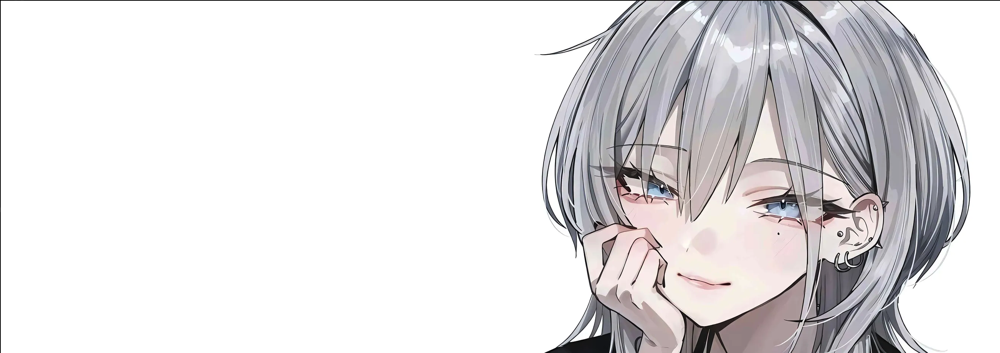

  

<h1 align="center">yo, i'm <a href="#">alifanO_x</a>!</h1>
<h3 align="center">welcome to my profile</h3>

i'm a frontend dev learning my way into game dev～☾

  
  
   
        

  

<table align="center">
  <tr>
    <td width="55%" align="center" valign="middle">
      
      

      

    </td>
    <td width="45%" align="center" valign="middle">
      
    </td>
  </tr>
</table>
