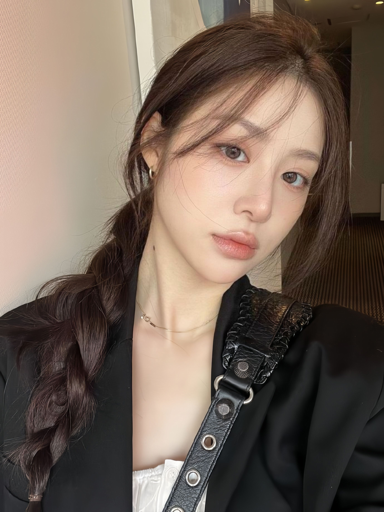

  

  <i>"build things that feel alive, even if the internet forgets them."</i>

<table>
  <tr>
    <td width="55%" valign="middle">
      <h1>LOL LOL LOL</h1>
      

        
        
      

    </td>
    <td width="45%" align="center" valign="middle">
      
    </td>
  </tr>
</table>

  

  

